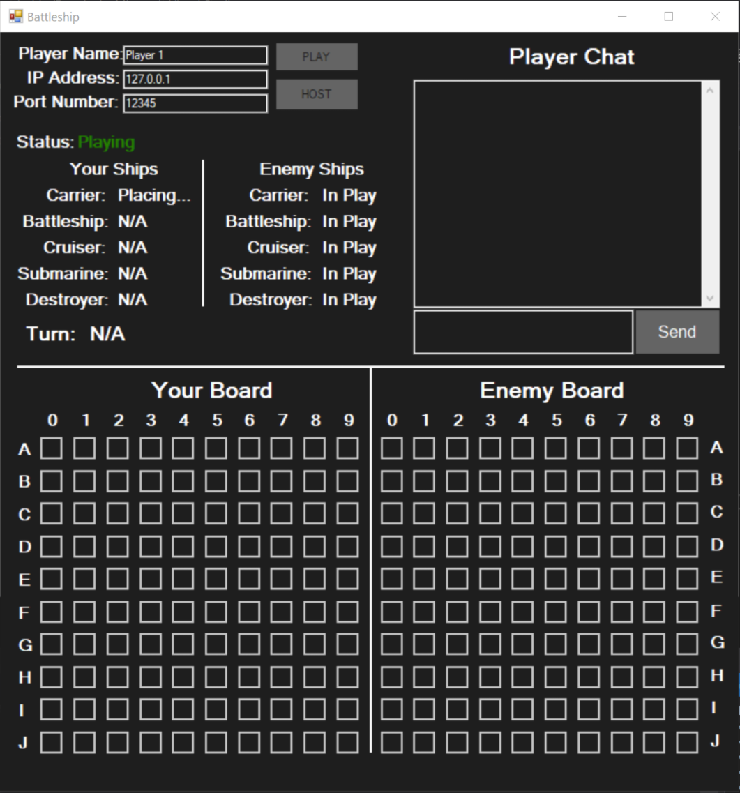
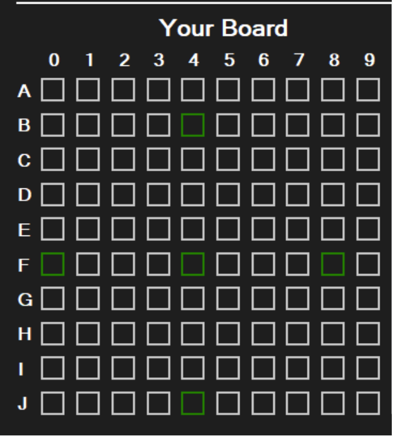
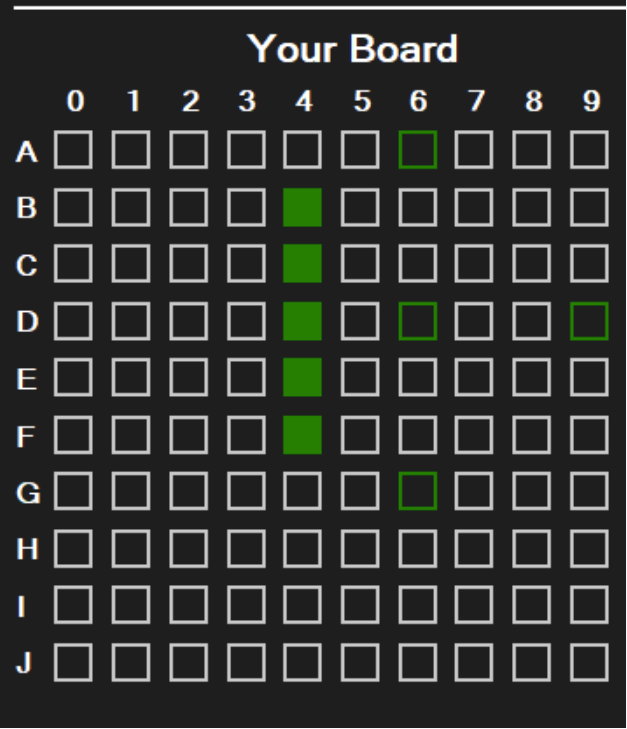
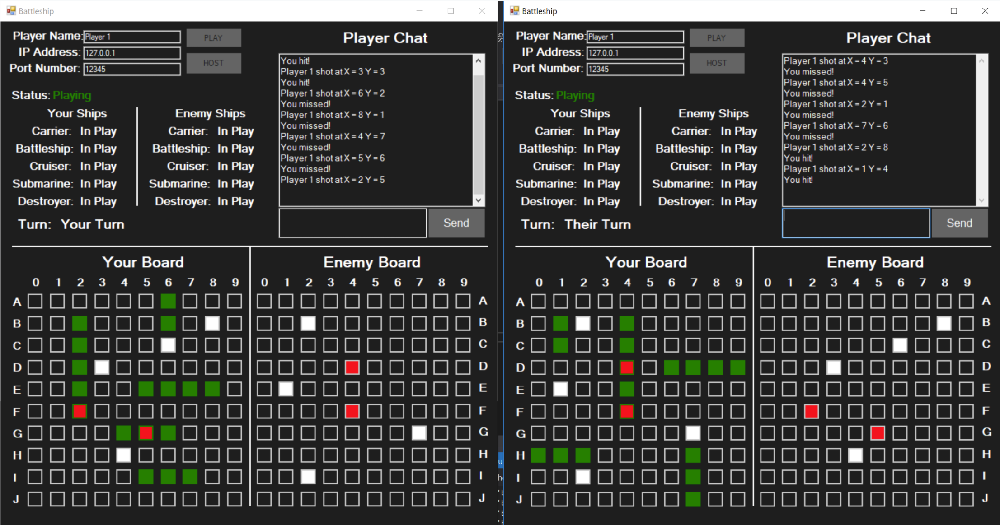
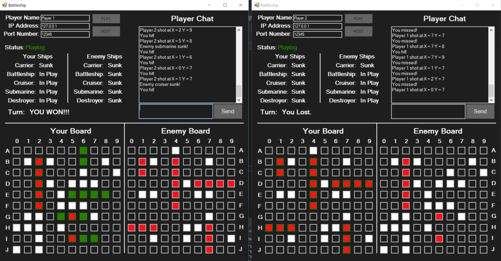

# C# Battleship Game
The goal of this project was to recreate the classic game Battleship with a GUI using C# and Windows Forms. The program was created to be as close as possible to the experience of playing the board game physically. It follows the same rules and allows the user to play over a network. The user can also chat with the other player while playing. 

# Playing the Game

The first step is to open the application. 

##### Figure 1: Application Open

At the top of the window is a player name, IP Address and port number textbox. Player name is for whatever nickname the player would like to use in the chat while playing. IP Address is whatever IP address is hosting the game if the user is joining a game being hosted. Port number is used when hosting a game to specify a certain port number to use.

The top right of the window shows the chat which also logs the moves the players make. Next to it on the left is the status of the game. When first opened it will allow placing of the ships to get the game started. 

The bottom half of the window shows the game board. The left is the grid for the player to place their ships and know where the opponent has attacked. It will display if any ships have been hit or sunk. The right side shows where the player has attacked the opponent grid. It will display red when the player hits a ship. 

## Placing the ships
* Goals
  * Don't allow ships to overlap
  * Show the user where they can place the ship

##### Figure 2: Placing ships

Figure 2 shows an example of placing the carrier. The center is where the user has selected and the 4 green squares show the directions the ship can be pointed. In this case nothing is preventing the ship from being place in any direction. So the carrier will be placed between B4 and F4.

##### Figure 3: Placing Ships cont.

Figure 3 shows the placement of the battleship. In this case the user has selected D6 as the position and the program show the user which direction the ship can be placed. The user is given 3 options because the battleship cannot be placed between D3 and D6 as it would be overlapping the carrier. 

## Main Game
Once both players have placed all their ships then the game will start. Each player will select a point of the opponent's grid to attack. The message will be sent between players applications and each notified whether or not a hit or miss has occured. Each player will take turns until one player has sunk all of the opponenets ships.

##### Figure 4: Playing

Once a player has sunk all the opponents ships then the game will grant a winner.

##### Figure 5: Winner

